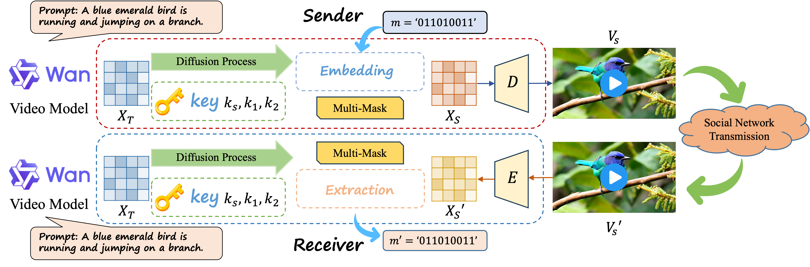

# LD-RoViS

This paper is accepted by NeurIPS 2025(poster)!

Official Implementation of paper "LD-RoViS: Training-free robust video steganography for deterministic latent diffusion model"

<p align="center">
    
<p>

#### 1. Installation


The installation process can refer to https://github.com/Wan-Video/Wan2.1

```
git clone https://github.com/xiangkun1999/LD-RoViS.git
cd LD-RoViS
```


Install dependencies:
```sh
# Ensure torch >= 2.4.0
pip install -r requirements.txt
```

Model download:
| T2V-1.3B      |      🤗 [Huggingface](https://huggingface.co/Wan-AI/Wan2.1-T2V-1.3B)     🤖 [ModelScope](https://www.modelscope.cn/models/Wan-AI/Wan2.1-T2V-1.3B)         | Supports 480P

Download models using huggingface-cli:
``` sh
pip install "huggingface_hub[cli]"
huggingface-cli download Wan-AI/Wan2.1-T2V-1.3B --local-dir ./Wan2.1-T2V-1.3B
```

Download models using modelscope-cli:
``` sh
pip install modelscope
modelscope download Wan-AI/Wan2.1-T2V-1.3B --local_dir ./Wan2.1-T2V-1.3B
```

#### 2. Generating cover and stego videos

You can use the following command to generate cover and stego videos:

``` sh
python sender.py  --task t2v-1.3B --size 832*480 --ckpt_dir ./Wan2.1-T2V-1.3B --prompt "It's drizzling in the sky, and on the country lane, an orange cat is riding a bicycle. To avoid the rain, it puts a lotus leaf on its head." --base_seed 99  --mask2 0.98 --mask1 0.32 --add_cfg 16
```

When you run the command, you will get the capacity of the stego video in the output. Meanwhile, the cover video will be save in the folder "video_cover" and the stego video will be save in the folder "video_steg".


#### 3. Evaluation

(1) If you want to evaluate the accuracy of the stego videos, you can use the following command:

``` sh
python receiver.py --video_path "video_steg/It's_05_14_20_45.mp4" --message_save_file "message.pt" --task t2v-1.3B --size 832*480 --ckpt_dir ./Wan2.1-T2V-1.3B --prompt "It's drizzling in the sky, and on the country lane, an orange cat is riding a bicycle. To avoid the rain, it puts a lotus leaf on its head." --base_seed 99  --mask2 0.98 --mask1 0.32 --add_cfg 16
```

(2) If you want to evaluate the PSNR of the stego videos, you can use the following command (you may need to modify the path of cover and stego videos):

``` sh
python PSNR.py
```

(3) If you want to evaluate the BRISQUE of the stego videos, you can refer to [BRISQUE](https://github.com/krshrimali/No-Reference-Image-Quality-Assessment-using-BRISQUE-Model).


(4) If you want to evaluate the robustness of LD-RoViS, you can uncomment ./wan/text2video.py.

## Citation
If you find this work useful, please consider citing:
```
@inproceedings{LD-RoViS2025,
  title     = {LD-RoViS: Training-free Robust Video Steganography for Deterministic Latent Diffusion Model},
  author    = {Xiangkun Wang and Kejiang Chen and Lincong Li and Weiming Zhang and Nenghai Yu},
  booktitle = {Advances in Neural Information Processing Systems},
  year      = {2025}
}
```

## Acknowledgments
We thank the following open-source projects for their contributions: [wan](https://github.com/Wan-Video/Wan2.1).


